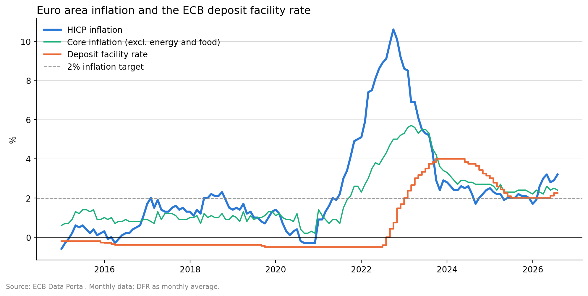
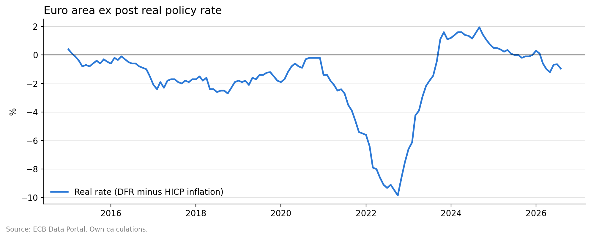

# How the ECB Responded to the 2021–2023 Inflation Surge

Euro area inflation rose above 2% in July 2021 and peaked at 10.6% in October 2022,
but the ECB only started raising rates in July 2022, twelve months later. As a result,
the real policy rate fell to around −10%, and monetary policy remained expansionary
in real terms until late 2023.



## Data

Four series downloaded programmatically from the
[ECB Data Portal](https://data.ecb.europa.eu/) API, from January 2015 to the latest
available observation:

| Series | Key | Frequency |
| --- | --- | --- |
| Deposit facility rate (DFR) | `FM.D.U2.EUR.4F.KR.DFR.LEV` | Daily |
| Euro short-term rate (€STR) | `EST.B.EU000A2X2A25.WT` | Business days |
| HICP inflation, annual rate | `HICP.M.U2.N.000000.4D0.ANR` | Monthly |
| Core HICP (excl. energy, food, alcohol and tobacco) | `HICP.M.U2.N.XEF000.4D0.ANR` | Monthly |

Daily series are converted to monthly averages to match the frequency of the HICP.

## Key findings

- **Late response:** inflation first rose above 2% in July 2021, and the first DFR hike
  came in July 2022, twelve months later. The DFR peaked at 4.00% in September 2023,
  eleven months after the inflation peak.
- **Deeply negative real rates:** the ex post real rate (DFR minus HICP inflation) reached
  around −9.9% in October 2022, and only turned positive in October 2023.
- **Full cycle:** since 2015 the DFR has changed 23 times: 11 cuts and 12 hikes, including
  two hikes in June and September 2026 as inflation picked up again to 3.2%.
- **€STR–DFR spread:** in a system of large excess liquidity, the €STR trades below the DFR.
  The spread widened to around −10 bp in 2023 and has narrowed to around −6 bp in 2026,
  as excess liquidity declines.



## Limitations

The real rate is computed ex post, using current inflation rather than inflation
expectations. A forward-looking measure would use survey or market-based expectations.

## How to run

```bash
pip install -r requirements.txt
```

Then open `ecb_monetary_policy_response.ipynb` and run all cells. The data is downloaded
directly from the ECB Data Portal, so the results update automatically with each new release.

## Author

Marc Ferrer, MSc in Banking and Quantitative Finance, Universidad Complutense de Madrid.